<a id="readme-top"></a>

<!-- PROJECT LOGO -->

<br />
<div align="center">
  <a href="https://github.com/M1KUAPP/Cekgu">
    <picture>
      <source media="(prefers-color-scheme: dark)" srcset="docs/readme/banner-dark.png">
      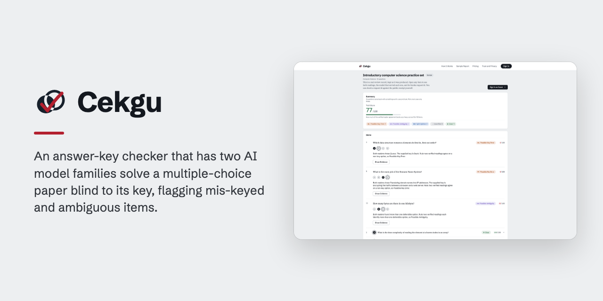
    </picture>
  </a>

  <h3>Cekgu</h3>

  <p>
    An answer-key checker that has two AI model families solve a multiple-choice paper blind to its key, flagging mis-keyed and ambiguous items.
    <br />
    <a href="https://youtu.be/zFASN69yQr8"><strong>Watch the Demo »</strong></a>
    &middot;
    <a href="#screenshots">Screenshots</a>
    &middot;
    <a href="https://github.com/M1KUAPP/Cekgu/issues/new?labels=bug">Report a Bug</a>
    <br />
  </p>

[![TypeScript][typescript-badge]][typescript-url]
[![React][react-badge]][react-url]
[![Vite][vite-badge]][vite-url]
[![Tailwind CSS][tailwindcss-badge]][tailwindcss-url]
[![Bun][bun-badge]][bun-url]
[![Hono][hono-badge]][hono-url]
[![PostgreSQL][postgresql-badge]][postgresql-url]
[![Drizzle][drizzle-badge]][drizzle-url]
[![GonkaRouter][gonkarouter-badge]][gonkarouter-url]
[![Docker][docker-badge]][docker-url]
[![Cloud Run][cloudrun-badge]][cloudrun-url]
[![Biome][biome-badge]][biome-url]
[![Playwright][playwright-badge]][playwright-url]

</div>

<!-- TABLE OF CONTENTS -->

## Table of Contents

<details>
  <summary>Expand</summary>
  <ol>
    <li>
      <a href="#about-the-project">About The Project</a>
      <ul>
        <li><a href="#screenshots">Screenshots</a></li>
        <li><a href="#how-it-works">How It Works</a></li>
        <li><a href="#features">Features</a></li>
        <li><a href="#architecture">Architecture</a></li>
        <li><a href="#tech-stack">Tech Stack</a></li>
      </ul>
    </li>
    <li>
      <a href="#getting-started">Getting Started</a>
      <ul>
        <li><a href="#prerequisites">Prerequisites</a></li>
        <li><a href="#installation">Installation</a></li>
      </ul>
    </li>
    <li><a href="#roadmap">Roadmap</a></li>
    <li><a href="#team">Team</a></li>
    <li><a href="#license">License</a></li>
    <li><a href="#acknowledgments">Acknowledgments</a></li>
  </ol>
</details>

<!-- ABOUT THE PROJECT -->

## About The Project

A mis-keyed question rewards the learner who guessed and penalizes the one who understood. A question with two defensible options does the same thing more quietly. Both are usually found after the paper has been sat, from the complaint rather than from the paper.

**Cekgu** puts one evidence step in front of that. An educator submits a small multiple-choice paper with its answer key. Two different model families solve each question through GonkaRouter, neither shown the key, and a fixed rule compares the two readings with each other before it ever compares them to the key. Every reading the two readers are allowed to use carries a Gonka Request ID a judge can look up.

| Cekgu does                                                | Cekgu does not                  |
| --------------------------------------------------------- | ------------------------------- |
| Flag disagreement between two independent readers         | Mark a paper or grade a learner |
| Flag ambiguity a reader declares for itself               | Certify a question as correct   |
| Show both readings, the rule sentence and the request ids | Prove a question is unambiguous |

**Why the right-hand column matters.** Two confident readers who agree are indistinguishable from an unambiguous question. The sample carries a real instance: a question written to be ambiguous came back **Clear** because both readers committed to the same single answer. Built for practice papers and synthetic examples, not for confidential or unreleased examinations.

Built for [MUBA Blockchain Hackathon 2026](https://www.mubahack.xyz/official_landing_page/code.html) (GonkaRouter — AI for Society track), where it placed 4th.

<p align="right"><a href="#readme-top">&uarr;</a></p>

### Screenshots

<video src="https://github.com/user-attachments/assets/09f7f9f2-9757-4d40-8aa3-0973fe5ee2b2" controls muted poster="docs/readme/demo-poster.jpg" width="100%">
  Your browser does not support inline video playback.
  <a href="https://github.com/M1KUAPP/Cekgu/releases/download/demo-video-v1/Cekgu-Demo-720p.mp4">Download the film</a> instead.
</video>

<table>
  <tr>
    <td width="50%" valign="top" align="left">
      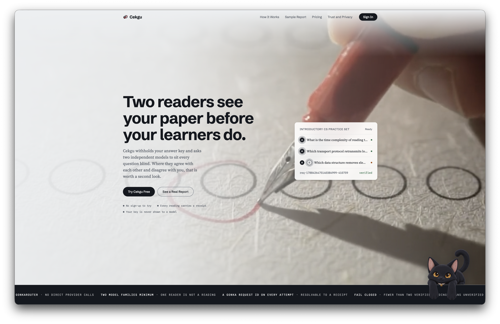
      <br />
      <strong>Landing Page</strong> · What a signed-out visitor sees first.
    </td>
    <td width="50%" valign="top" align="left">
      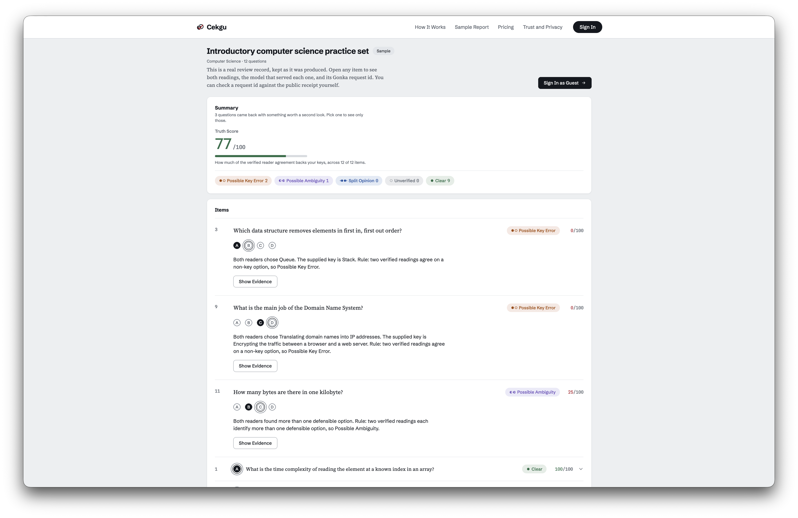
      <br />
      <strong>Sample Report</strong> · A public report with its Truth Score and verdict breakdown, no account needed.
    </td>
  </tr>
  <tr>
    <td width="50%" valign="top" align="left">
      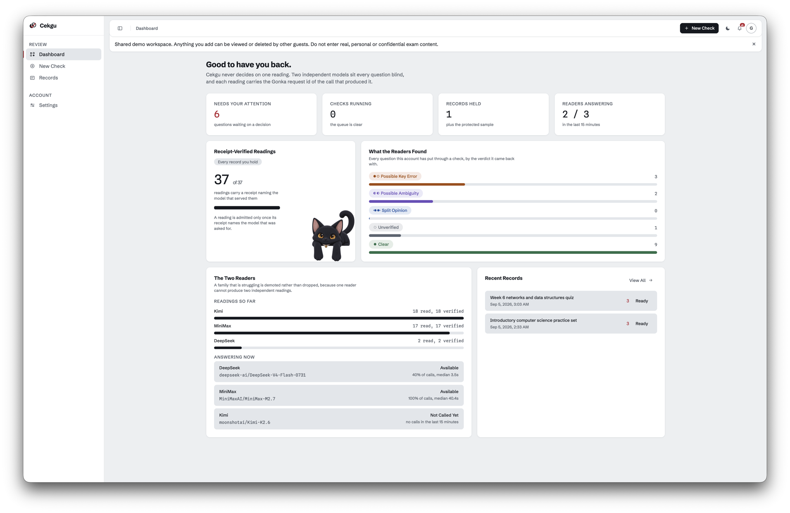
      <br />
      <strong>Dashboard</strong> · Verified readings against total, the verdict breakdown, and each family's share of the work.
    </td>
    <td width="50%" valign="top" align="left">
      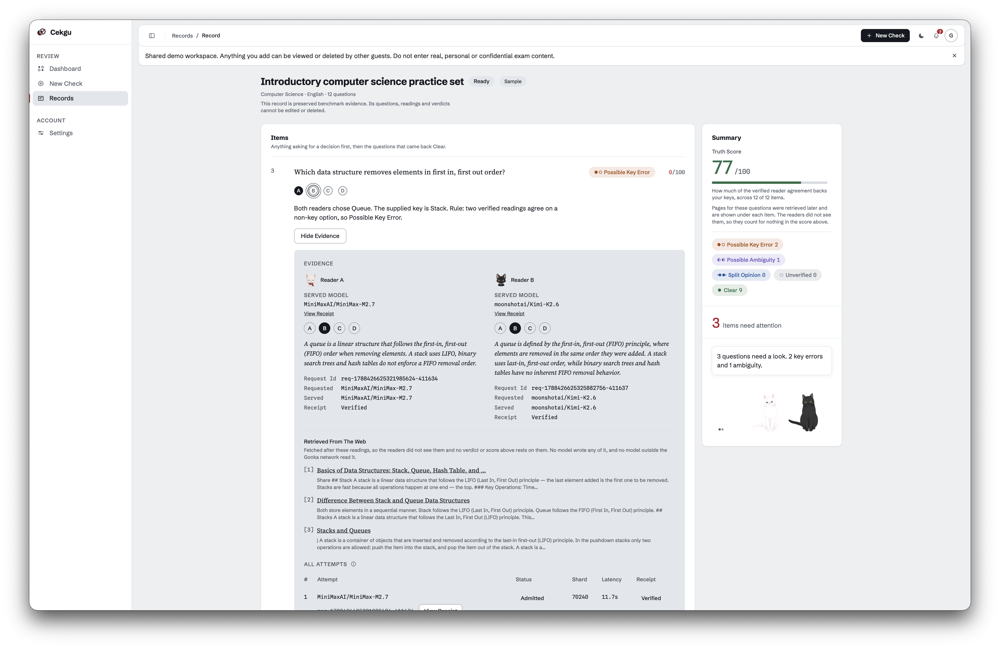
      <br />
      <strong>Item Evidence</strong> · Two served models, two request ids, receipt states, and the attempts that were refused.
    </td>
  </tr>
</table>

<p align="right"><a href="#readme-top">&uarr;</a></p>

### How It Works

1.  **Enter a paper.** Type the questions, options and key into **New Check**, paste a link to a page that already has them, or upload a scan or photograph — then edit the draft that comes back. No draft submits itself; the educator corrects and sends each one.

    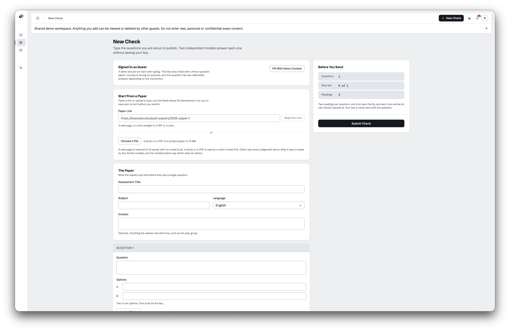

1.  **Two families read it blind.** Each question is queued. A round takes two seats and fills each from a different model family through GonkaRouter. The prompt carries the stem, the lettered options, the subject and the language — never the supplied key, and never the other reader's output.

    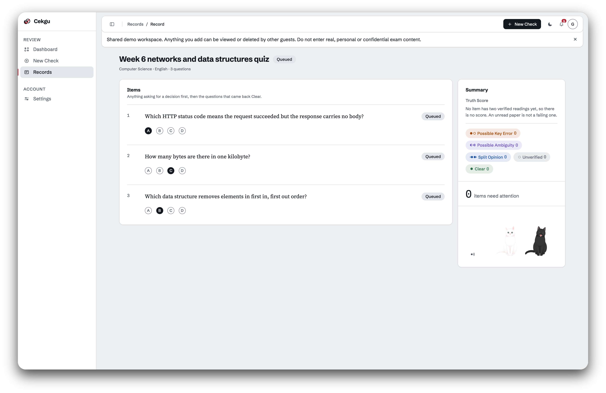

1.  **Evidence is admitted, not assumed.** A reply becomes a usable reading only if all five hold:

    - Returned HTTP 200
    - Carried no fallback header
    - Parsed as the requested JSON
    - Answered with a letter that is actually one of the options
    - Matched a public Gonka receipt naming the model that was requested

    Anything else is written down as a refused attempt with its reason, and takes no part in the verdict.

    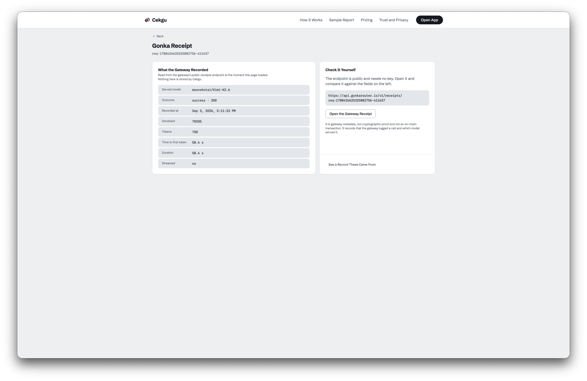

    Every request id in the product opens this page, and the gateway URL on it is public and needs no key — so the claim is checked against the gateway rather than taken from us.

1.  **One rule decides.** The first two admitted readings from distinct served models go through a five-outcome rule in a fixed order. The order is the design: disagreement before ambiguity, ambiguity before the key.

    | Verdict                | Fires when                                                                    |
    | ---------------------- | ----------------------------------------------------------------------------- |
    | **Unverified**         | Fewer than two distinct receipt-verified readings survived. No verdict given. |
    | **Split Opinion**      | The two readers committed to different options.                               |
    | **Possible Ambiguity** | Both readers named more than one option as defensible.                        |
    | **Clear**              | Both readers chose the supplied key.                                          |
    | **Possible Key Error** | Both readers agreed on the same option, and it is not the key.                |

    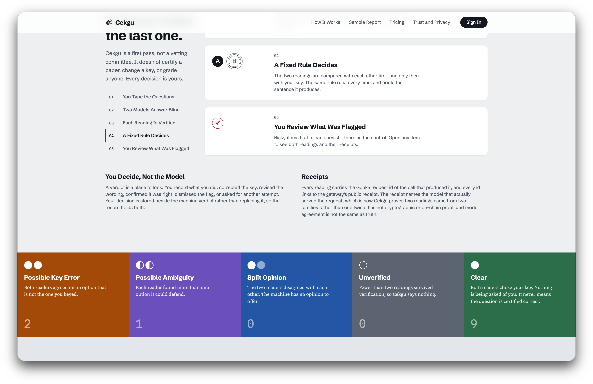

1.  **The public web is consulted, and quoted.** Before the readers run, one search fetches up to four pages relevant to the question, and both readers are shown the same snippets as background rather than authority. The supplied key is never in the query — searching for the key returns pages that agree with the key.

    This is a **search API, not a model**: it returns what other people published and forms no opinion. `include_answer` is hard-coded false — a provider's own generated answer would be reasoning off the gateway — and both that flag and the absence of any `answer` read are asserted by tests. Without `TAVILY_API_KEY` the readers work from their own knowledge and every verdict is unchanged.

    **Every record states which of three retrieval states it is in:**

    | State                                 | What the record shows                                                                      |
    | ------------------------------------- | ------------------------------------------------------------------------------------------ |
    | Checked **with** retrieval            | Every page linked and quoted, and each reader reports what those pages did to its answer   |
    | Checked **before** retrieval shipped  | Says so plainly, rather than leaving the feature looking absent                            |
    | Pages attached **after** the readings | Labeled as fetched later — the readers did not see them, and no verdict or score uses them |

    The third exists because the sample's pass was captured on 3 September and retrieval shipped on the 6th; which state the sample is in depends on whether the build has re-seeded it from the committed fixture. See [TRD section 22](docs/TRD.md#22-live-retrieval-for-cross-verification).

    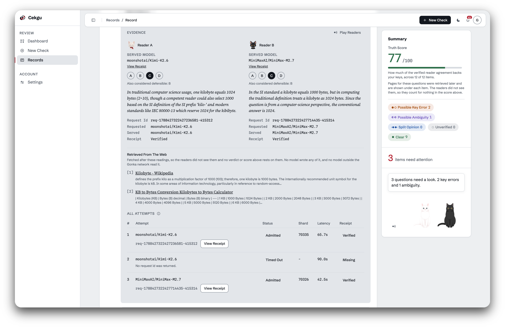

1.  **A score puts a number on it.** The same two readings produce a Truth Score from 0 to 100, shown on the record and on every item. Computed in `apps/shared/truth-score.ts` from readings already on the record — no extra inference call, and no model is asked how confident it feels, because no receipt could back that.

    | Input                            | Weight                            |
    | -------------------------------- | --------------------------------- |
    | A reader's committed option      | Half the score                    |
    | Options it would still defend    | The other half, split across them |
    | Retrieval corroborates a reading | That reading counts for more      |
    | Retrieval contradicts a reading  | That reading counts for half      |
    | Retrieval finds nothing          | Exactly neutral                   |

    A hedge therefore costs the key something without erasing the commitment. Retrieval is a **confidence adjustment, not a vote**, and can never flip a reading into meaning its opposite; finding nothing is neutral because most exam items have no page that settles them.

    **Reading the number.** It says how much of the verified reader agreement backs the supplied key, not that the question is correct. An **Unverified** item scores null rather than 0, because 0 is what two readers agreeing _against_ the key earns. The record figure always prints its own denominator: three verified items out of twelve can average 100.

    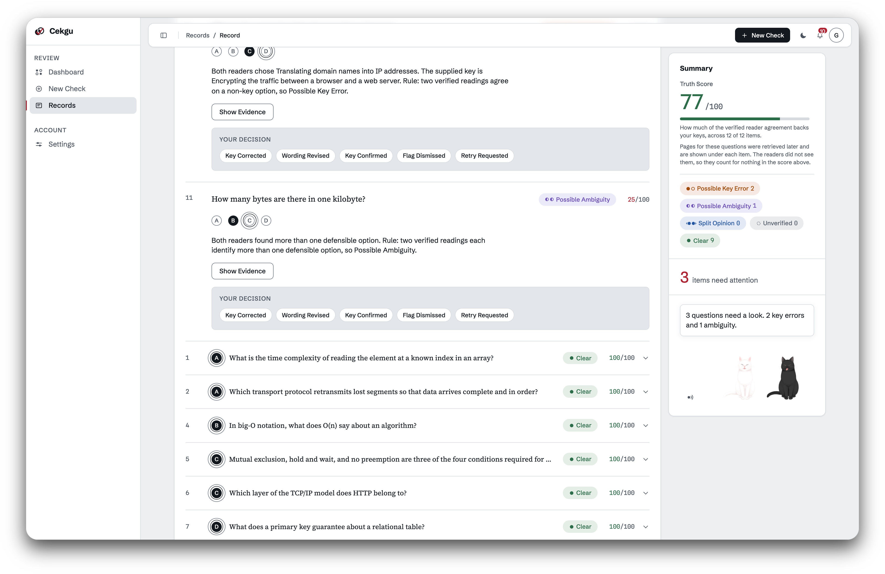

1.  **A human decides.** The verdict is an attention signal, not a mark. The educator records what they did — corrected the key, revised the wording, confirmed the key, dismissed the flag, or asked for a retry — and that decision is stored with the item.

    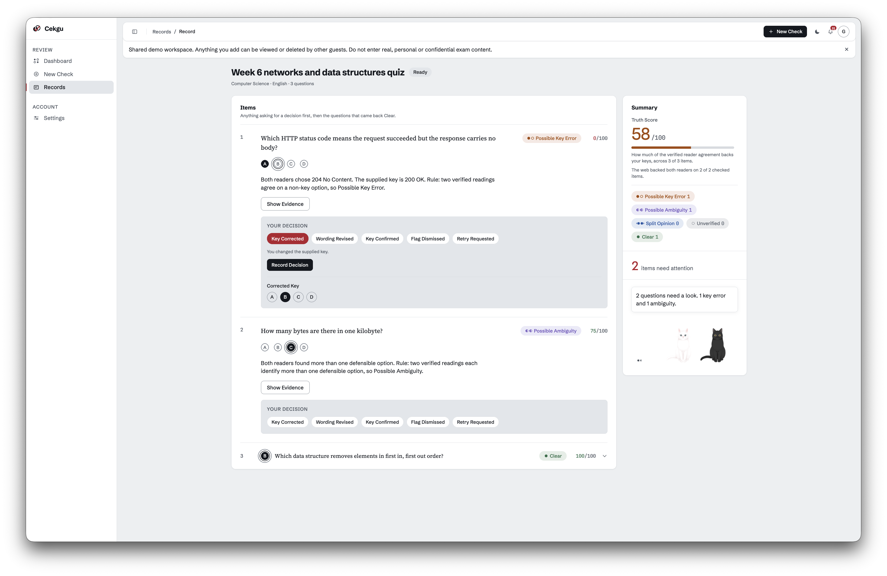

<p align="right"><a href="#readme-top">&uarr;</a></p>

### Features

- **All reasoning through GonkaRouter.** The track's four requirements are enforced in code, not asserted in prose: one file, `gateway/client.ts`, calls a model, and the guard fails the build if a provider appears anywhere else.
- **Two models cross-verify.** A verdict needs two admitted readings whose **served** models differ, taken from the receipt and never from the model requested, so two calls to one family can never count as two readers (`gateway/`, `verdict.ts`). Reasoning content is cleaned before comparison: `<think>` blocks are stripped, and each prompt carries a nonce so the gateway cache cannot serve one inference under two request ids.
- **Request IDs surfaced in the UI.** Every reading shows request id, devshard, requested and served model, and receipt state, and `/receipt/:requestId` reads the receipt back through the server, because the gateway sends no CORS header. The viewer distinguishes a receipt that does not exist from a gateway it could not reach.
- **Explicit consensus logic.** The five-outcome rule is a pure function in `shared/verdict.ts`, with its reason sentence shown beside the verdict. The Truth Score is a second pure function over the same two readings from the same round, so number and verdict always describe the same evidence, and it grades within a verdict rather than ranking across verdicts — [TRD section 14](docs/TRD.md#truth-score) sets out where the bands overlap.
- **No silent substitution.** Every call sends `X-Gonka-No-Fallback: true`, and any reply carrying an `X-Gonka-Fallback` header is refused even when its body is a perfectly good completion.
- **Retrieval decides nothing.** `apps/server/retrieval/` reaches the public web and is held by `only-gonkarouter.test.ts` to the same rule as the two provider directories: it may not import the verdict rule, the schema, the round or the gateway client. It is not a third exemption, because it calls no model.
- **Every attempt recorded.** Admitted or refused, a timeout, a 429, a receipt mismatch and a fallback each leave a row with its own reason, shown in the evidence panel under the two readings, and a record streams progress over SSE, so a queued paper fills in without a refresh.
- **Bounded concurrency and model health.** A Postgres `SKIP LOCKED` claim per item, at most four calls in flight against the gateway account, three attempts per family, and a deferred hedge that duplicates a call only after 45 seconds. Model health is tracked over a rolling 15-minute window, and a family with three failures and nothing successful behind it is demoted rather than dropped, because dropping it can leave a round with one candidate and a guaranteed **Unverified**.
- **Public sample report.** Readable signed out, seeded from a real recorded benchmark pass — 12 questions, 42 attempts, 24 of them admitted, captured 3 September 2026 with the request ids intact.
- **Guest and account sign-in.** Guest sign-in enters one shared workspace with no account needed, and guest records expire after 24 hours; email and password accounts work too, plus Google sign-in when the deployment has an OAuth client. A dashboard counts verified readings against total for the account, and each family's share of the work by served model.
- **A paper from a link or an upload.** A pasted link is fetched and reduced to the words on the page by a parser that calls no model, then structured into a draft by a Gonka model — the only input that reaches nothing outside the Gonka network, so it works with no vision key — and links resolving inside a private network are refused before a socket opens, which matters on Cloud Run where `169.254.169.254` hands out service-account tokens. An upload of PNG, JPEG, WebP or PDF up to 10 MB is transcribed to text and then structured into a draft by a Gonka model.
- **An optional Live2D mascot.** Off unless `MASCOT_ENABLED=true`, it respects Reduce Motion and falls back to a still image when WebGL is unavailable.

<p align="right"><a href="#readme-top">&uarr;</a></p>

### Architecture

<picture>
  <source media="(prefers-color-scheme: dark)" srcset="docs/readme/architecture-dark.svg">
  
</picture>

The diagram is drawn with [archify](https://github.com/tt-a1i/archify) from [`architecture.json`](docs/readme/architecture.json).

| Piece                 | What it holds or does                                                                     |
| --------------------- | ----------------------------------------------------------------------------------------- |
| Hono on Cloud Run     | One process serving both the API and the built client                                     |
| PostgreSQL            | Accounts, records and decisions — plus `attempts`, which is the evidence trail            |
| An `attempts` row     | Request id, devshard, requested and served model, receipt JSON, latency, rejection reason |
| Queue worker          | Claims one item, runs its round, writes the verdict, moves on                             |
| 15-minute claim lease | Released when it expires, so a Cloud Run restart cannot strand a question                 |

Checking is asynchronous because a decentralized network is sometimes slow and sometimes unavailable. Where evidence is insufficient the pipeline fails closed to **Unverified** rather than manufacturing a second opinion.

**The two directories that may name a provider**, stated here rather than left to be found. Neither decides anything, and the guard test holds both to that.

| Directory                 | Role                                                           | Its own prompt forbids                                                                        |
| ------------------------- | -------------------------------------------------------------- | --------------------------------------------------------------------------------------------- |
| `apps/server/transcribe/` | Transcribes the words already printed on an image or PDF       | Answering a question, marking an option correct, supplying an unprinted key, writing a record |
| `apps/server/chat/`       | Phrases the record assistant's answers from readers' own facts | Naming a correct option, confirming or rejecting a key, solving a question                    |

Every judgment about what transcribed words mean is made afterwards by Gonka models carrying request ids ([TRD section 20](docs/TRD.md#20-reading-a-paper-from-an-upload)).

**The record assistant runs on the gateway.** It was briefly phrased off-gateway — the more serious of the two exemptions, since answering a question about a record sits closer to reasoning than transcription does. It no longer is: `CHAT_PROVIDER` defaults to `gonka`, and its inference goes to MiniMax-M2.7 through GonkaRouter.

**Its turn carries a real `x-request-id` with a public receipt**, not a provider response id. Measured on production at 06:35 on 5 September: two tool calls and an answer in 15 s, `req-1788590155239980984-1077255`.

Four things hold, all checkable in the code:

- Every fact it states is retrieved by pure functions in [`apps/server/chat/`](apps/server/chat/) from readings two Gonka models produced, each carrying an `x-request-id` and a public receipt. The model phrases those facts, and may not add one
- Citations resolve server-side against the loaded record, never trusted from the model; one that does not resolve is dropped rather than rendered, so an invented request id never becomes a link a judge can click
- It may not adjudicate — no naming a correct option, confirming or rejecting a key, or solving a question. Asked "why is question 1 flagged?" on a **Clear** question, it says so instead of inventing a reason
- The off-gateway path survives behind `CHAT_PROVIDER=gemini`; if used, the turn's id is labeled by provider and drawn as a visibly different object from a Gonka receipt — unlinked, because there is nothing to open

**Every blind read, verdict, receipt and answer in this product is GonkaRouter's.** `apps/server/transcribe/` is used; `apps/server/chat/`'s off-gateway client is dormant. The test named above fails the build if that list widens, if either directory imports the verdict rule or the record writer, or if a provider hostname reaches the reasoning path at all. [TRD section 21](docs/TRD.md#21-the-readers-voice-and-the-record-assistant) holds the decision and its reasoning.

Implementation detail, API contracts, model measurements, queue policy and test evidence live in [TRD](docs/TRD.md). Users, scope and the business hypothesis live in [PRODUCT](docs/PRODUCT.md), and the acceptance criteria in [PRD](docs/PRD.md).

<p align="right"><a href="#readme-top">&uarr;</a></p>

### Tech Stack

- **Languages:** TypeScript.
- **Frontend:** React 19, React Router 8, Vite 8 and Tailwind 4 for the review workspace, evidence views and public pages; PixiJS, pixi-live2d-display and Web Speech for the Live2D reader seats, their captions and their voice.
- **Backend:** Bun 1.4 as server runtime, package manager and test runner; Hono and Zod for the API, boundary validation and SSE; Better Auth for email and password, Google OAuth and the shared Guest workspace.
- **Data:** PostgreSQL (Neon), Drizzle ORM and Drizzle Kit for records, items, attempts, dispositions, model health and migrations.
- **AI and services:** GonkaRouter for blind reads, draft structuring and receipts — all reasoning; GonkaRouter's MiniMax-M2.7 with tool calling for the assistant's grounded answers about one record, with receipts; a vision model, uploads only, for printed text from an image or PDF, no judgment; a search API, no model, for text other people published, quoted verbatim, no judgment.
- **Infrastructure:** Docker, Cloud Run and Artifact Registry for the container build and a manual production deploy with [`scripts/deploy-local.sh`](scripts/deploy-local.sh).
- **Tooling:** Biome, Prettier, TypeScript and Playwright for lint, format, strict types and a browser smoke pass.

<p align="right"><a href="#readme-top">&uarr;</a></p>

<!-- GETTING STARTED -->

## Getting Started

Running it locally needs a Postgres database and a GonkaRouter key, because there is no offline inference path and there is not meant to be one.

<p align="right"><a href="#readme-top">&uarr;</a></p>

### Prerequisites

- [Bun](https://bun.sh) 1.4 or newer — the server runtime, package manager and test runner.
- [PostgreSQL](https://www.postgresql.org/) — a database, local or hosted.
- [GonkaRouter](https://gonkarouter.io) API key — the only inference credential, since there is no offline inference path.
- [Tavily](https://tavily.com) key (`TAVILY_API_KEY`), optional — enables live retrieval. Without it the readers work from their own knowledge and every verdict is unchanged.
- [Google OAuth](https://developers.google.com/identity/protocols/oauth2) client, optional — for Google sign-in. Without it the app still runs and Google sign-in disappears.
- [Gemini API](https://ai.google.dev/gemini-api/docs) key (`GEMINI_API_KEY`), optional — a vision API key to enable paper uploads. Without it the app still runs and `POST /api/extract` answers 503 saying uploads are off; pasting a link to a web page keeps working, because that path needs no vision model.

<p align="right"><a href="#readme-top">&uarr;</a></p>

### Installation

1.  **Install dependencies.** This also wires the Husky commit hooks.

    ```sh
    bun install
    ```

1.  **Copy the environment template and fill it in.** Key names only ever live in the example file, never values.

    ```sh
    cp .env.example .env
    ```

    | Variable                   | Required | Notes                                                              |
    | -------------------------- | -------- | ------------------------------------------------------------------ |
    | `GONKA_API_KEY`            | yes      | The only inference credential                                      |
    | `DATABASE_URL`             | yes      | Postgres connection string                                         |
    | `BETTER_AUTH_SECRET`       | yes      | Session signing secret                                             |
    | `GUEST_EMAIL`              | yes      | The shared Guest account, seeded on start                          |
    | `GUEST_PASSWORD`           | yes      | As above                                                           |
    | `GONKA_BASE_URL_OPENAI`    | no       | Defaults to `https://api.gonkarouter.io/v1`, `/v1` suffix included |
    | `BETTER_AUTH_URL`          | no       | Defaults to `http://localhost:8080`                                |
    | `PORT`                     | no       | Defaults to `8080`                                                 |
    | `GOOGLE_CLIENT_ID/_SECRET` | no       | Both must be set for Google sign-in to appear                      |
    | `MASCOT_ENABLED`           | no       | `true` turns on the Live2D readers                                 |
    | `MIGRATE_ON_START`         | no       | `false` skips migrations and sample seeding                        |
    | `WORKER_ENABLED`           | no       | `false` runs the API without the queue worker                      |

1.  **Apply the migrations.**

    ```sh
    bun run db:migrate
    ```

1.  **Start both processes.** The API runs on `8080` under Bun's watcher and Vite serves the client on `5173`, proxying `/api` to it.

    ```sh
    bun run dev
    ```

1.  **Run the checks.** No CI runs these.

    ```sh
    bun run check
    ```

    `bun run check` runs `bun run lint` (editorconfig-checker across every tracked file, Biome across the code, Prettier across Markdown and YAML), `bun run typecheck` (`tsc --noEmit`, strict, `noUncheckedIndexedAccess`), `bun test` (498 pass, 77 skip, 0 fail across 52 files), `bun run check:anchors` and `bun run test:guard`. `bun run e2e` runs Playwright against the deployment named by `E2E_BASE_URL`; it is not part of `check`.

    `bun run e2e` points at the **deployed** URL by default, not your working tree, and prints its target on every run — use `bun run e2e:local`, or set `E2E_BASE_URL` to another deployment. The 77 skipped tests need a live gateway key or database and are opt-in on purpose: gateway latency varies, and **Unverified** is a valid result rather than a failure.

    One local-only trap: `apps/server/routes/extract.test.ts` asserts the 503 a missing transcription key produces, so a `.env` setting `GEMINI_API_KEY` sends it down the live path into a database that is not running. Run `GEMINI_API_KEY= bun test` for a clean local pass.

<p align="right"><a href="#readme-top">&uarr;</a></p>

<!-- ROADMAP -->

## Roadmap

See [open issues](https://github.com/M1KUAPP/Cekgu/issues) for a full list of proposed features (and known issues).

<p align="right"><a href="#readme-top">&uarr;</a></p>

<!-- CONTRIBUTING -->

## Team

<a href="https://github.com/M1KUAPP/Cekgu/graphs/contributors">
  
</a>

Made with [contrib.rocks](https://contrib.rocks).

<p align="right"><a href="#readme-top">&uarr;</a></p>

<!-- LICENSE -->

## License

See [LICENSE](LICENSE) for more information.

<p align="right"><a href="#readme-top">&uarr;</a></p>

<!-- ACKNOWLEDGMENTS -->

## Acknowledgments

- [GonkaRouter](https://gonkarouter.io) — the gateway every reasoning call in this project runs through.
- [MUBA Blockchain Hackathon 2026](https://www.mubahack.xyz/official_landing_page/code.html) — the event and the AI for Society track [brief](docs/BRIEF.md); Team M1KU built Cekgu for it, placing 4th and earning 20M GonkaRouter tokens over six months.
- [Live2D sample data](https://www.live2d.com/download/sample-data/) — Tororo and Hijiki are Live2D sample characters, not Cekgu originals — used under the Live2D Free Material License Agreement and built with the Live2D Cubism SDK.
- [Acceptable use](docs/legal/acceptable-use.md) — **Do not put confidential papers, unreleased examination content, personal data or learner identifiers into any deployment.** Guest is one shared workspace: other guests can see and delete what you add, and guest records are removed after 24 hours. Deleting a private record hides it and purges it after 30 days; a record untouched for 90 days is removed. Demo notices: [terms](docs/legal/terms.md), [privacy](docs/legal/privacy.md), [acceptable use](docs/legal/acceptable-use.md).
- [archify](https://github.com/tt-a1i/archify) — architecture diagrams.
- [Shields.io](https://shields.io)
- [contrib.rocks](https://contrib.rocks)

<p align="right"><a href="#readme-top">&uarr;</a></p>

<!-- MARKDOWN LINKS & IMAGES -->

[typescript-badge]: https://img.shields.io/badge/TypeScript-3178C6?style=for-the-badge&logo=typescript&logoColor=white
[typescript-url]: https://www.typescriptlang.org/
[react-badge]: https://img.shields.io/badge/React-61DAFB?style=for-the-badge&logo=react&logoColor=black
[react-url]: https://react.dev/
[vite-badge]: https://img.shields.io/badge/Vite-9135FF?style=for-the-badge&logo=vite&logoColor=white
[vite-url]: https://vite.dev/
[tailwindcss-badge]: https://img.shields.io/badge/Tailwind_CSS-06B6D4?style=for-the-badge&logo=tailwindcss&logoColor=white
[tailwindcss-url]: https://tailwindcss.com/
[bun-badge]: https://img.shields.io/badge/Bun-000000?style=for-the-badge&logo=bun&logoColor=white
[bun-url]: https://bun.sh/
[hono-badge]: https://img.shields.io/badge/Hono-E36002?style=for-the-badge&logo=hono&logoColor=white
[hono-url]: https://hono.dev/
[postgresql-badge]: https://img.shields.io/badge/PostgreSQL-4169E1?style=for-the-badge&logo=postgresql&logoColor=white
[postgresql-url]: https://www.postgresql.org/
[drizzle-badge]: https://img.shields.io/badge/Drizzle-C5F74F?style=for-the-badge&logo=drizzle&logoColor=black
[drizzle-url]: https://orm.drizzle.team/
[gonkarouter-badge]: https://img.shields.io/badge/GonkaRouter-B3202F?style=for-the-badge
[gonkarouter-url]: https://gonkarouter.io
[docker-badge]: https://img.shields.io/badge/Docker-2496ED?style=for-the-badge&logo=docker&logoColor=white
[docker-url]: https://www.docker.com/
[cloudrun-badge]: https://img.shields.io/badge/Cloud_Run-4285F4?style=for-the-badge&logo=googlecloud&logoColor=white
[cloudrun-url]: https://cloud.google.com/run
[biome-badge]: https://img.shields.io/badge/Biome-60A5FA?style=for-the-badge&logo=biome&logoColor=white
[biome-url]: https://biomejs.dev/
[playwright-badge]: https://img.shields.io/badge/Playwright-2EAD33?style=for-the-badge
[playwright-url]: https://playwright.dev/
